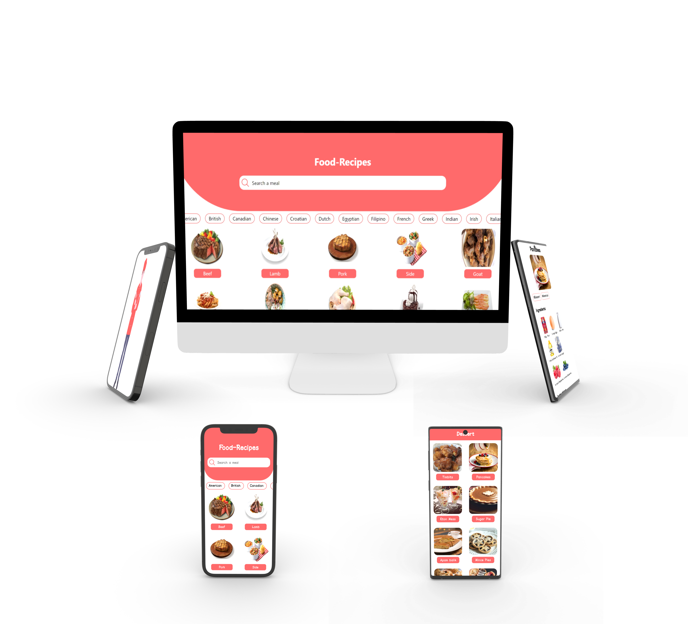

# Food-Recipes

**"Are you tired of the same old meals? Craving inspiration in the kitchen? Look no further! Our app offers a treasure trove of diverse recipes, catering to all tastes, preferences, and dietary needs. Whether you're a novice cook or a seasoned chef, our step-by-step instructions and handy tips will guide you through every dish with ease. Say goodbye to mealtime monotony and hello to a world of delicious possibilities at your fingertips"  This Food-Recipes app is built with <a href="https://docs.expo.dev/">Expo</a> making it easy to build cross-platform apps. The live-demo for this fron-end project can be found <a href="https://varun-v-1410.github.io/Food-Recipes/">here</a>**

## Requirements
+ [NodeJS](https://nodejs.org/en)
+ [Expo](https://docs.expo.dev)

## 🔗 Links
[Live demo](https://varun-v-1410.github.io/Food-Recipes/) 
